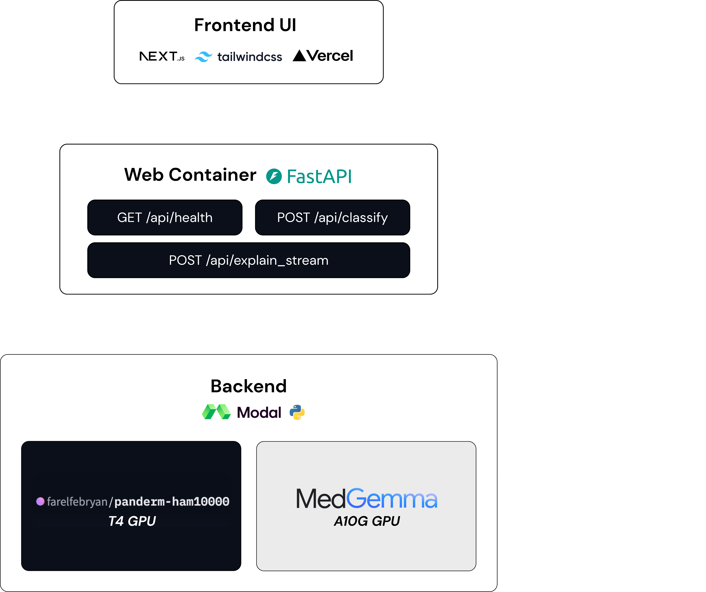
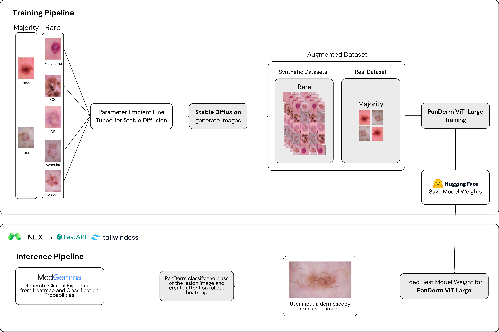

# DermaDiff

**Deteksi Kanker Kulit secara Interpretatif melalui Optimisasi Vision Foundation Model dengan Augmentasi Sintetis Berbasis Stable Diffusion**

DermaDiff adalah sistem *clinical decision support* berbasis AI untuk deteksi kanker kulit yang mengintegrasikan tiga komponen dalam satu pipeline end-to-end: augmentasi sintetis berbasis latent diffusion model untuk mengatasi ketidakseimbangan kelas pada dataset dermoskopi, PanDerm ViT-Large sebagai vision foundation model klasifikasi khusus dermatologi, dan MedGemma 4B-IT sebagai lapisan interpretatif yang menghasilkan penjelasan klinis berbahasa alami berbasis ABCD rules. Sistem dirancang sebagai alat second opinion bagi dokter dengan akses dermoskop, menerapkan prinsip keselamatan escalate-never-clear untuk memastikan setiap lesi mencurigakan selalu direkomendasikan evaluasi lanjut.

---

## Tech Stack

### Frontend


### Backend


### AI/ML Pipeline


| Komponen | Teknologi |
|---|---|
| Generative Model | Stable Diffusion 2.1 Base, SDXL Base, SD 3.5 Large |
| Adapter Fine-Tuning | LoRA, DoRA (parameter-efficient fine-tuning) |
| Classifier | PanDerm ViT-Large (vision foundation model dermatologi) |
| Model Interpretatif | MedGemma 4B-IT |
| Infrastruktur Inferensi | Modal Serverless — NVIDIA T4 (PanDerm), NVIDIA A10G (MedGemma) |
| Model Registry | Hugging Face Hub |

---

## Arsitektur Sistem



Arsitektur sistem DermaDiff terdiri dari tiga lapisan yang saling terhubung. **Frontend UI** dibangun dengan Next.js dan Tailwind CSS, di-deploy melalui Vercel, menyediakan antarmuka bagi dokter untuk mengunggah citra dermoskopi. Permintaan dari frontend diteruskan ke **Web Container** berbasis FastAPI yang mengekspos tiga endpoint utama: `GET /api/health` untuk pemeriksaan status layanan, `POST /api/classify` untuk klasifikasi lesi, dan `POST /api/explain_stream` untuk streaming penjelasan klinis secara real-time.

Lapisan **Backend** berjalan di atas Modal sebagai platform serverless GPU, dengan dua model dijalankan pada instance terpisah: PanDerm ViT-Large pada NVIDIA T4 GPU untuk klasifikasi dan pembuatan attention rollout heatmap, serta MedGemma pada NVIDIA A10G GPU untuk generasi penjelasan klinis berbahasa alami. Pemisahan instance ini memungkinkan setiap model dijalankan pada spesifikasi GPU yang sesuai dengan kebutuhan komputasinya masing-masing, sekaligus memungkinkan scaling independen. Hasil klasifikasi dan penjelasan dikembalikan ke frontend sebagai API response terintegrasi.

## AI/ML Pipeline



Pipeline AI/ML DermaDiff terbagi menjadi dua tahap besar: **training pipeline** dan **inference pipeline**.

**Training Pipeline** diawali dengan memisahkan dataset HAM10000 menjadi kelas mayoritas (Nevi, BKL) dan kelas minoritas/rare (Melanoma, BCC, DF, Vascular, Akiec). Seluruh kelas minoritas menjalani parameter-efficient fine-tuning pada Stable Diffusion menggunakan LoRA atau DoRA untuk menghasilkan citra dermoskopi sintetis yang kelas-spesifik. Citra sintetis pada kelas rare kemudian digabungkan dengan citra asli pada kelas mayoritas untuk membentuk augmented dataset, yang selanjutnya digunakan untuk melatih PanDerm ViT-Large sebagai classifier. Bobot model dengan performa validasi terbaik disimpan ke Hugging Face Hub sebagai model registry.

**Inference Pipeline** dimulai ketika pengguna mengunggah citra lesi kulit dermoskopi. Bobot terbaik PanDerm ViT-Large dimuat untuk memproses citra tersebut, menghasilkan prediksi kelas beserta attention rollout heatmap yang menyoroti area lesi paling berpengaruh terhadap keputusan model. Keluaran ini, yaitu heatmap dan distribusi probabilitas klasifikasi, kemudian diteruskan ke MedGemma yang menghasilkan penjelasan klinis berbahasa alami sebagai lapisan interpretatif akhir bagi dokter.

---

# Repository Structure

Repository ini terdiri dari dua bagian utama, yaitu `fine-tune` dan `website`.

```text
dermadiff-ai/
│
├── fine-tune/
│   ├── assets/
│   ├── dataset/
│   ├── evaluation/
│   ├── models/
│   │   ├── stable-diffusion-2.1-base/
│   │   ├── stable-diffusion-xl-base/
│   │   ├── stable-diffusion-3.5_large/
│   │   └── stable-diffusion-xl-base-dora/
│   ├── dataset_prep.py
│   ├── requirements.txt
│   └── README.md
│
└── website/
    ├── backend/
    │   ├── api/
    │   ├── core/
    │   ├── models/
    │   ├── app.py
    │   └── README.md
    │
    └── frontend/
        ├── public/
        ├── src/
        │   ├── app/
        │   ├── components/
        │   └── lib/
        ├── package.json
        ├── next.config.ts
        ├── tsconfig.json
        └── README.md
```

## `fine-tune/`

Folder ini berisi kode dan konfigurasi yang digunakan untuk proses persiapan dataset, fine-tuning, pembuatan citra sintetis, dan evaluasi model.

| Direktori/File     | Keterangan                                                                 |
| ------------------ | -------------------------------------------------------------------------- |
| `assets/`          | Berisi aset pendukung dokumentasi dan visualisasi.                         |
| `dataset/`         | Berisi script yang berkaitan dengan pengambilan dan persiapan dataset.     |
| `evaluation/`      | Berisi script untuk melakukan evaluasi model dan citra hasil generasi.     |
| `models/`          | Berisi implementasi dan konfigurasi fine-tuning untuk masing-masing model. |
| `dataset_prep.py`  | Digunakan untuk mempersiapkan dataset sebelum proses training.             |
| `requirements.txt` | Daftar dependency Python yang diperlukan.                                  |
| `README.md`        | Dokumentasi untuk bagian `fine-tune`.                                      |

### `fine-tune/models/`

Direktori ini memisahkan eksperimen berdasarkan model yang digunakan.

* `stable-diffusion-2.1-base/` — eksperimen menggunakan Stable Diffusion 2.1.
* `stable-diffusion-xl-base/` — eksperimen menggunakan Stable Diffusion XL dengan LoRA.
* `stable-diffusion-3.5_large/` — eksperimen menggunakan Stable Diffusion 3.5 Large dengan LoRA.
* `stable-diffusion-xl-base-dora/` — eksperimen menggunakan Stable Diffusion XL dengan DoRA.

Setiap direktori model memiliki script yang berkaitan dengan proses fine-tuning, pembuatan citra, training classifier, dan evaluasi.

---

## `website/`

Folder ini berisi aplikasi web DermaDiff AI yang terdiri dari backend dan frontend.

### `website/backend/`

Backend bertanggung jawab terhadap penyediaan API dan proses inference model.

```text
backend/
├── api/
├── core/
├── models/
├── app.py
└── README.md
```

* `api/` — berisi endpoint dan routing API.
* `core/` — berisi konfigurasi dan konstanta yang digunakan oleh backend.
* `models/` — berisi implementasi model yang digunakan dalam proses inference.
* `app.py` — entry point dan konfigurasi aplikasi backend.
* `README.md` — dokumentasi backend.

### `website/frontend/`

Frontend merupakan antarmuka aplikasi yang dibangun menggunakan Next.js.

```text
frontend/
├── public/
├── src/
│   ├── app/
│   ├── components/
│   └── lib/
├── package.json
├── next.config.ts
└── tsconfig.json
```

* `public/` — berisi aset statis.
* `src/app/` — berisi halaman dan routing aplikasi.
* `src/components/` — berisi komponen antarmuka yang dapat digunakan kembali.
* `src/lib/` — berisi fungsi utilitas dan kebutuhan komunikasi dengan backend.
* `package.json` — konfigurasi dependency dan script project.
* `next.config.ts` — konfigurasi Next.js.
* `tsconfig.json` — konfigurasi TypeScript.

---

## Summary

Secara umum, pembagian repository adalah sebagai berikut:

```text
fine-tune/
└── Persiapan dataset, fine-tuning, dan evaluasi model

website/
├── backend/
│   └── API dan proses inference
└── frontend/
    └── Antarmuka aplikasi web
```